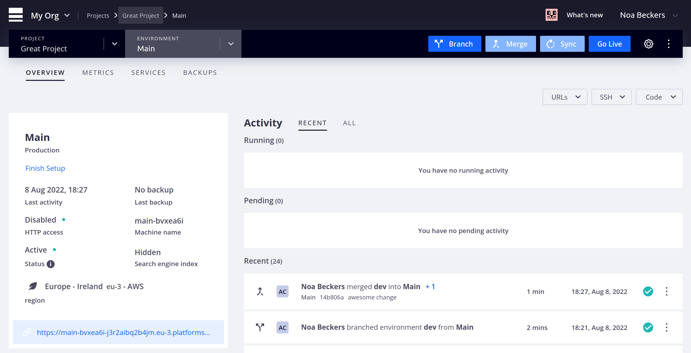
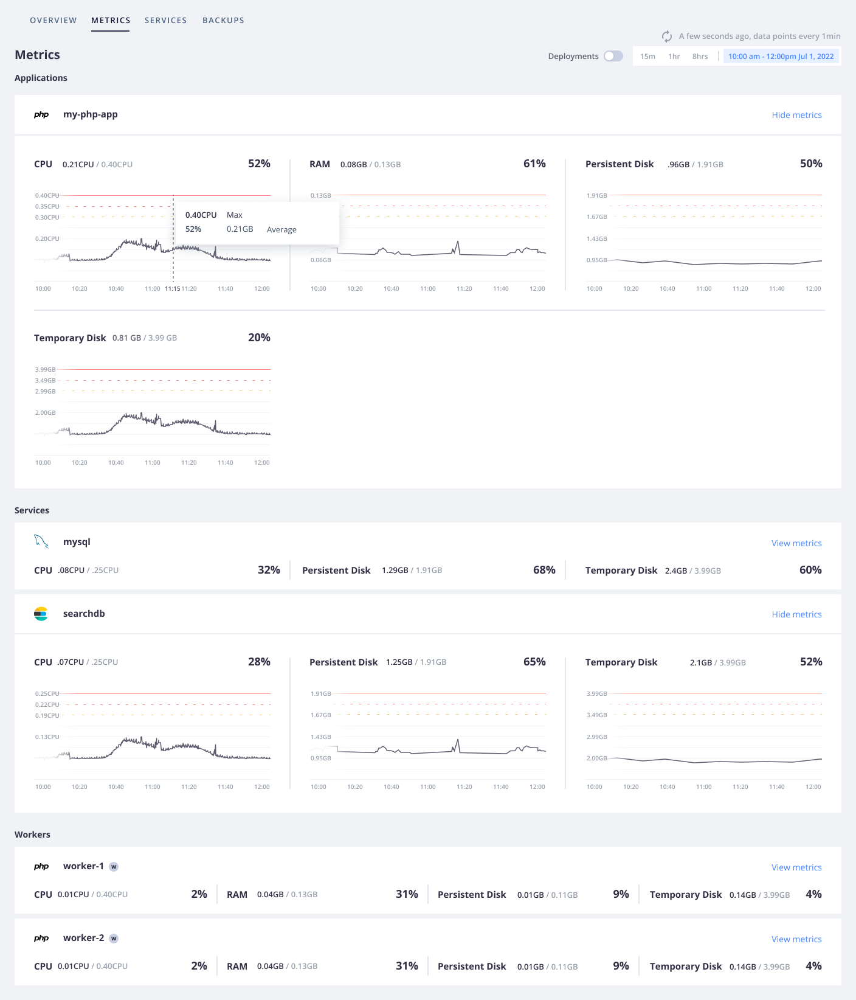

## Objective  

Once your app is up and running, you want to monitor it to make sure it stays that way.
Take advantage of the observability of apps running on Web PaaS to see everything that's happening.

## Check activities

All events that change your environments are logged as activities.
See a list of all activities by running the following command:

```bash
platform activities
```

You get a table with all activities that have run or are running.
The most recent one at the top of the table is probably your merge of the `dev` branch into `main`.

To see all the details of that activity, copy its `ID` from the table.
Then use the ID in place of `<ID>` in the following command:

```bash
platform activity:get <ID>
```

This returns the build log from the merge activity.
This way, you can keep track of everything that happens in your project.

## View logs

Another way to keep track of your project and troubleshoot any issues is to view its logs.
Different types of logs are available, such as error logs and any logs your app creates.

To see the access log, a list of all attempts to access your website, run the following command:

```bash
platform log access
```

If you visited your site to test it, you see your visit here.
Otherwise, get its URL by running this command:

```bash
platform environment:url
```

Open the website in a browser and then run `platform log access` again.
You now see your visit.

For an interactive prompt with all available logs, run `platform log`.

## Monitor metrics

In addition to keeping track of events, you might want to see how your infrastructure responds to these events.
For that, your project offers infrastructure metrics where you can see your CPU, RAM, and disk usage.

These metrics are available in the Web PaaS Console,
which is a web interface that offers similar options for interacting with your project as the CLI.

Open the Console by running this command:

```bash
platform web
```

This opens your project in the current environment.
You can change environments using the `--environment` flag.

You see information about your project as well as a list of activities,
which should be the same as what you saw by running `platform activities`.



To see metrics, open the **Metrics** tab.
You see your CPU, RAM, and disk usage over the past 15 minutes, with options for changing the time frame.



Now you know where to go to get information on your app's performance.
Activities, logs, and metrics are useful for keeping track of changes and investigating issues.

But to stay on top of everything, you want to be notified wherever you are.
Continue to find out how.


