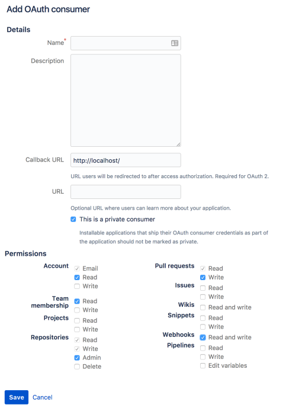

**Last updated 28th November 2023**

## Objective  

{}

You can set up an integration with either Bitbucket Cloud
or a self-hosted [Bitbucket Server](https://confluence.atlassian.com/bitbucketserver/).

{}

## Bitbucket Cloud

### 1. Create an OAuth consumer

To integrate your Web PaaS project with an existing Bitbucket Cloud repository,
[create an OAuth consumer](https://support.atlassian.com/bitbucket-cloud/docs/use-oauth-on-bitbucket-cloud/):

> [!primary]  
> Be sure to define the above as a _private_ consumer by checking the **This is a private consumer** box.
> 
The **Callback URL** isn't important in this case.
You can set it to `http://localhost`.

Copy the **Key** and **Secret** for your consumer.

### 2. Enable the Cloud integration



{}
1\. Follow the [Bitbucket instructions to create a webhook](https://support.atlassian.com/bitbucket-cloud/docs/manage-webhooks/#Create-webhooks)

   using the URL you copied.
   Make sure to update the triggers to include all pull request events except comments and approval.
{}

## Bitbucket Server

### 1. Generate a token

To integrate your Web PaaS project with a repository on a Bitbucket Server instance,
you first need to create an access token associated with your account.

[Generate a token](https://confluence.atlassian.com/display/BitbucketServer/HTTP+access+tokens).
and give it at least read access to projects and admin access to repositories.
Copy the token.

### 2. Enable the Server integration



{}
1\. Follow the [Bitbucket instructions to create a webhook](https://confluence.atlassian.com/bitbucketserver076/managing-webhooks-in-bitbucket-server-1026535073.html#ManagingwebhooksinBitbucketServer-creatingwebhooksCreatingwebhooks)

   using the URL you copied.
   Send all events except comments and approval.
{}

{}

## Source of truth



{}
